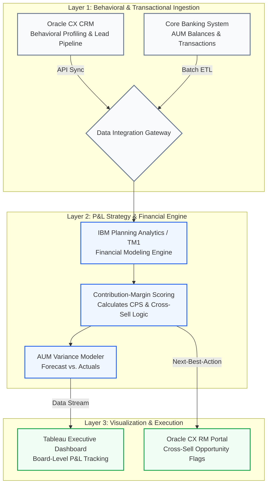
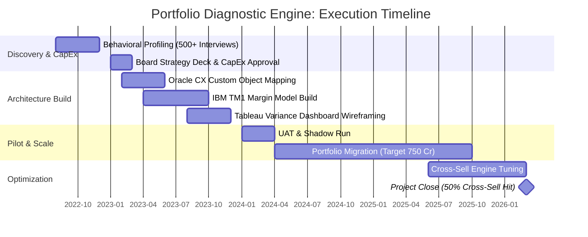

# 🏦 HNI Portfolio Growth Strategy & Diagnostic Engine
**Federal Bank (Sanitized) | Aug 2022 – Mar 2026**

> **Investment Memo & Architecture Profile**
> Transitioned the High Net Worth Individual (HNI) Priority Banking division from an intuition-led relationship model into a deterministic, data-driven growth engine. By engineering a proprietary Contribution-Margin Scoring model, this initiative scaled managed AUM to **INR 750 Cr**, achieved a **145% YoY growth rate**, and secured **INR 10-15 Cr** in internal capital investment.

---

## 📑 1. The Business Situation & Strategy
Retail wealth management often falls into the trap of indexing heavily on gross Asset Under Management (AUM) acquisition, masking the actual unit economics and servicing costs of high-maintenance clients. 

Prior to this initiative, the HNI strategy relied on qualitative "gut feelings" from Relationship Managers (RMs). This created a critical operational bottleneck: high variance in AUM forecasting and a stalled cross-sell rate. 

**The Execution Strategy:** 
We treated the HNI portfolio as a distinct P&L entity. By integrating quantitative financial modeling with qualitative behavioral profiling (validated through 500+ direct customer interviews), we mapped the exact decision triggers of our HNI base. This allowed us to build portfolio diagnostics and variance tracking engines that transformed raw data into predictive, cross-sell actions.

### 🏆 Key Performance Outcomes
*   **Scale:** Grew the managed portfolio to **INR 750 Cr AUM** (145% YoY).
*   **Market Penetration:** Acquired 1,000+ new high-value accounts.
*   **Unit Economics:** Achieved a **50% asset cross-sell rate** through predictive product placement.
*   **Capital Allocation:** Secured **INR 10–15 Cr** in internal board-level funding by proving deterministic ROI.

---

## 🧮 2. The Financial Logic: Contribution-Margin Engine
The cornerstone of the transformation was pivoting the frontline RM focus from "Top-Line AUM" to "Net Contribution Margin." 

We built a proprietary scoring model in **IBM Planning Analytics (TM1)** and **Advanced Excel (Macros)** that assessed the true profitability of an account. The underlying logic evaluated the spread between revenue generated and servicing depreciation, adjusted by the behavioral risk profile extracted from Oracle CRM:

$$CPS = \sum_{t=1}^{n} \left( \frac{NII_t + NFI_t - OpEx_t}{(1 + WACC)^t} \right) \times \beta_{behavioral}$$

*(Where $CPS$ is Client Profitability Score, $NII$ is Net Interest Income, $NFI$ is Non-Fund Income, $OpEx$ is Servicing Cost, and $\beta_{behavioral}$ is the risk profile multiplier.)*

---

## 🏗️ 3. Technical Architecture & Data Flow
To operationalize the mathematical models, we established a "Single Source of Truth" pipeline, tightly coupling our operational CRM with IBM's OLAP cubes and Tableau visualization layers.

---

## 📅 4. Multi-Year Execution Roadmap
This initiative spanned from fundamental research to full portfolio migration, requiring rigorous change management across the Priority Banking vertical.

---

## 📁 5. Proof of Execution (`/assets`)
*The following sanitized artifacts are available in this repository to validate the execution capabilities detailed above.*

1.  [`/assets/HNI_Contribution_Margin_Simulator.xlsm`](#)
    *   **Description:** A macro-enabled financial model demonstrating the core logic replicated in IBM TM1.
    *   **Strategic Value:** Allows technical reviewers to input mock client variables (AUM mix, RM hours) and observe how the system generates a risk-adjusted Client Profitability Score. Proves Advanced Excel/VBA competency and CFO-level financial modeling.
2.  [`/assets/Exec_Investment_Memo_Sanitized.pdf`](#)
    *   **Description:** A sanitized, 5-slide PDF skeleton of the actual strategy presentation used to secure the INR 10-15 Cr board investment.
    *   **Strategic Value:** Demonstrates the ability to translate complex data science and TM1 architecture into a compelling P&L business case for non-technical C-suite executives.
